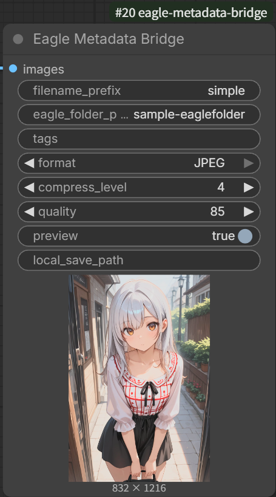

# Eagle Metadata Bridge

[English](#english) | [日本語](#japanese)

<a name="english"></a>

## 🇬🇧 English

A [ComfyUI](https://github.com/comfyanonymous/ComfyUI) custom node that saves generated images directly to [Eagle](https://en.eagle.cool/) with automatically extracted metadata — checkpoint, LoRAs, prompt, seed, sampler settings — attached as tags and annotations.



### Features

- **Auto-tagging** — Reads the ComfyUI workflow graph and generates Eagle tags: checkpoint name, LoRA names, prompt tokens, seed, steps, CFG, sampler
- **Auto-annotation** — Writes a structured generation info block to the Eagle annotation field; supports multi-sampler workflows (e.g. hires.fix, ADetailer)
- **PNG / WebP / JPEG** — Choose your output format; quality/compression settings hide automatically when not applicable
- **Dynamic folder assignment** — Route images into Eagle folders using date and node-parameter placeholders (e.g. `Portraits/%date:yyyy-MM-dd%`)
- **Local save** — Optionally save a copy to a local directory at the same time

### Companion plugin

Install [comfyui-auto-tagger](https://github.com/NNNebel/comfyui-auto-tagger) in Eagle to read the embedded metadata and display full generation info inside Eagle. Eagle Metadata Bridge embeds an `eagle_bridge` signal in each saved image; the companion plugin uses this signal to reliably trace the workflow graph and extract accurate metadata.

## Requirements

- [Eagle](https://en.eagle.cool/) desktop app running (version 4.0+ recommended)
- ComfyUI

## Installation

### Via ComfyUI-Manager (recommended)

Search for **Eagle Metadata Bridge** in the ComfyUI-Manager custom node list and click Install.

### Manual

```bash
cd ComfyUI/custom_nodes
git clone https://github.com/NNNebel/eagle-metadata-bridge.git
cd eagle-metadata-bridge
pip install -r requirements.txt
```

Restart ComfyUI after installation.

## Usage

Add the **Eagle Metadata Bridge** node (category: **Eagle**) as the final output node in your workflow instead of — or alongside — Save Image.

Connect your image tensor to `images` and queue the prompt. The node will:
1. Save the image with embedded metadata
2. Send it to Eagle with auto-generated tags and annotation

### Parameters

| Parameter | Description |
|-----------|-------------|
| `images` | Image tensor from your pipeline |
| `filename_prefix` | Filename prefix. Supports placeholders: `%date:hhmmss%`, `%NodeTitle.param%` |
| `eagle_folder_path` | Nested Eagle folder path (auto-created if missing). Supports placeholders. Example: `Characters/%date:yyyy-MM-dd%` |
| `tags` | Manual tags to add (comma-separated). Combined with auto-generated tags |
| `format` | Output format: `PNG`, `WebP`, or `JPEG` |
| `compress_level` | PNG compression level 0–9 (visible only when format = PNG) |
| `quality` | WebP/JPEG quality 1–100 (visible only when format = WebP or JPEG) |
| `preview` | Show image preview in the ComfyUI queue |
| `local_save_path` | Also save to this local directory. Relative paths use the ComfyUI output folder as base. Supports placeholders |

### Filename / folder placeholders

| Placeholder | Example output |
|-------------|---------------|
| `%date:yyyy-MM-dd%` | `2026-04-24` |
| `%date:hhmmss%` | `153012` |
| `%NodeTitle.param%` | value of `param` input on a node titled `NodeTitle` |

### Nodes

| Node | Description |
|------|-------------|
| **Eagle Metadata Bridge** | Main node. Reads `config.json` for output settings; defaults to all fields enabled. |
| **Eagle Metadata Bridge (Test)** | Has 18 individual ON/OFF toggles for every tag and annotation field. Ignores `config.json` — useful for trying settings before committing them to the file. |

### config.json

`config.json` lives next to the node files in `custom_nodes/eagle-metadata-bridge/`.  
Edit it to control which fields appear in Eagle tags and annotations. ComfyUI does **not** need to be restarted — the file is read on every execution.

```json
{
  "eagle_port": 41595,
  "tag": {
    "checkpoint": true,
    "lora": true,
    "positive": true,
    "negative": true,
    "seed": true,
    "steps": true,
    "cfg": true,
    "sampler": true
  },
  "annotation": {
    "checkpoint": true,
    "lora": true,
    "positive": true,
    "negative": true,
    "seed": true,
    "steps": true,
    "cfg": true,
    "sampler": true,
    "scheduler": true
  }
}
```

Set any field to `false` to exclude it. Omitted fields default to `true`.  
`scheduler` is available in `annotation` only — it is not output as a tag.

If the file contains invalid JSON or unrecognised keys, an error is printed in the ComfyUI log and the affected section falls back to all-enabled.

## Sample workflow

`examples/sample-workflow.webp` contains embedded workflow metadata.  
Drag and drop it onto the ComfyUI canvas to load the workflow directly.

The workflow demonstrates:
- Eagle Metadata Bridge as the output node
- ADetailer-style img2img pass (DetailerForEachDebug)
- Automatic tag and annotation generation

## License

MIT — see [LICENSE](LICENSE)

---

<a name="japanese"></a>

## 🇯🇵 日本語

ComfyUIで生成した画像を [Eagle](https://jp.eagle.cool/) に直接送信するカスタムノードです。チェックポイント・LoRA・プロンプト・シード・サンプラー設定などのメタデータを自動抽出し、Eagleのタグとアノテーションとして付与します。


### 機能

- **自動タグ付け** — ComfyUIのワークフローグラフを解析し、チェックポイント名・LoRA名・プロンプトトークン・Seed・Steps・CFG・サンプラーをEagleタグとして生成
- **自動アノテーション** — 生成情報をEagleのメモ欄に構造化テキストで書き込み。マルチサンプラーワークフロー（hires.fix、ADetailer等）にも対応
- **PNG / WebP / JPEG** — 出力フォーマットを選択可能。不要な設定項目（品質・圧縮レベル）は非選択時に自動で非表示
- **動的フォルダー振り分け** — 日付やノードパラメータのプレースホルダーを使ってEagleフォルダーに振り分け（例: `Portraits/%date:yyyy-MM-dd%`）。フォルダーが存在しない場合は自動作成
- **ローカル保存** — Eagle送信と同時にローカルディレクトリにも保存可能

### コンパニオンプラグイン

Eagle側で [comfyui-auto-tagger](https://github.com/NNNebel/comfyui-auto-tagger) をインストールすると、埋め込まれたメタデータを読み取りEagle内で生成情報をフル表示できます。Eagle Metadata Bridge は保存画像に `eagle_bridge` シグナルを埋め込み、コンパニオンプラグインがこのシグナルを使ってワークフローグラフを確実にトレースします。

## 必要環境

- [Eagle](https://jp.eagle.cool/) デスクトップアプリ（バージョン 4.0 以上推奨）
- ComfyUI

## インストール

### ComfyUI-Manager 経由（推奨）

ComfyUI-Manager のカスタムノード一覧で **Eagle Metadata Bridge** を検索してインストール。

### 手動インストール

```bash
cd ComfyUI/custom_nodes
git clone https://github.com/NNNebel/eagle-metadata-bridge.git
cd eagle-metadata-bridge
pip install -r requirements.txt
```

インストール後、ComfyUIを再起動してください。

## 使い方

ワークフローの最終出力ノードとして **Eagle Metadata Bridge** ノード（カテゴリ: **Eagle**）を追加し、Save Image の代わりに（または並行して）使用します。

`images` に画像テンソルを接続してプロンプトを実行すると：
1. メタデータを埋め込んだ画像を保存
2. 自動生成したタグとアノテーションをつけてEagleに送信

### パラメーター

| パラメーター | 説明 |
|------------|------|
| `images` | パイプラインからの画像テンソル |
| `filename_prefix` | ファイル名プレフィックス。プレースホルダー使用可: `%date:hhmmss%`、`%NodeTitle.param%` |
| `eagle_folder_path` | Eagleフォルダーのパス（存在しない場合は自動作成）。プレースホルダー使用可。例: `Characters/%date:yyyy-MM-dd%` |
| `tags` | 手動タグ（カンマ区切り）。自動生成タグと結合されます |
| `format` | 出力フォーマット: `PNG`、`WebP`、`JPEG` |
| `compress_level` | PNG圧縮レベル 0〜9（PNG選択時のみ表示） |
| `quality` | WebP/JPEG品質 1〜100（WebP/JPEG選択時のみ表示） |
| `preview` | ComfyUIキューでプレビューを表示 |
| `local_save_path` | ローカル保存先ディレクトリ。相対パスはComfyUI outputフォルダー基準。プレースホルダー使用可 |

### ファイル名・フォルダープレースホルダー

| プレースホルダー | 出力例 |
|---------------|-------|
| `%date:yyyy-MM-dd%` | `2026-04-24` |
| `%date:hhmmss%` | `153012` |
| `%NodeTitle.param%` | `NodeTitle` というノードの `param` 入力値 |

### ノード一覧

| ノード | 説明 |
|-------|------|
| **Eagle Metadata Bridge** | メインノード。出力設定は `config.json` を参照。未設定の場合は全フィールドを出力。 |
| **Eagle Metadata Bridge (Test)** | タグ・アノテーションの各フィールドを個別にON/OFFできるノード。`config.json` を無視するので、設定をファイルに書き込む前に動作を試すのに使う。 |

### config.json

`config.json` はノードファイルと同じ `custom_nodes/eagle-metadata-bridge/` フォルダーにあります。  
Eagleに送るタグとアノテーションに含めるフィールドをここで制御します。変更はComfyUIの**再起動不要**で、実行のたびに読み込まれます。

```json
{
  "eagle_port": 41595,
  "tag": {
    "checkpoint": true,
    "lora": true,
    "positive": true,
    "negative": true,
    "seed": true,
    "steps": true,
    "cfg": true,
    "sampler": true
  },
  "annotation": {
    "checkpoint": true,
    "lora": true,
    "positive": true,
    "negative": true,
    "seed": true,
    "steps": true,
    "cfg": true,
    "sampler": true,
    "scheduler": true
  }
}
```

`false` にしたフィールドはタグ・アノテーションから除外されます。省略したフィールドは `true` 扱いです。  
`scheduler` は `annotation` セクションのみ有効です（タグとしては出力されません）。

JSONが不正な場合や不明なキーが含まれる場合は、ComfyUIのログにエラーが表示され、該当セクションは全フィールド有効にフォールバックします。

## サンプルワークフロー

`examples/sample-workflow.webp` にワークフローメタデータが埋め込まれています。  
ComfyUIキャンバスにドラッグ&ドロップするとワークフローを直接読み込めます。

収録内容：
- Eagle Metadata Bridge を出力ノードとして使用
- ADetailer スタイルのimg2imgパス（DetailerForEachDebug）
- タグ・アノテーションの自動生成

## ライセンス

MIT — [LICENSE](LICENSE) を参照
NSE) を参照
